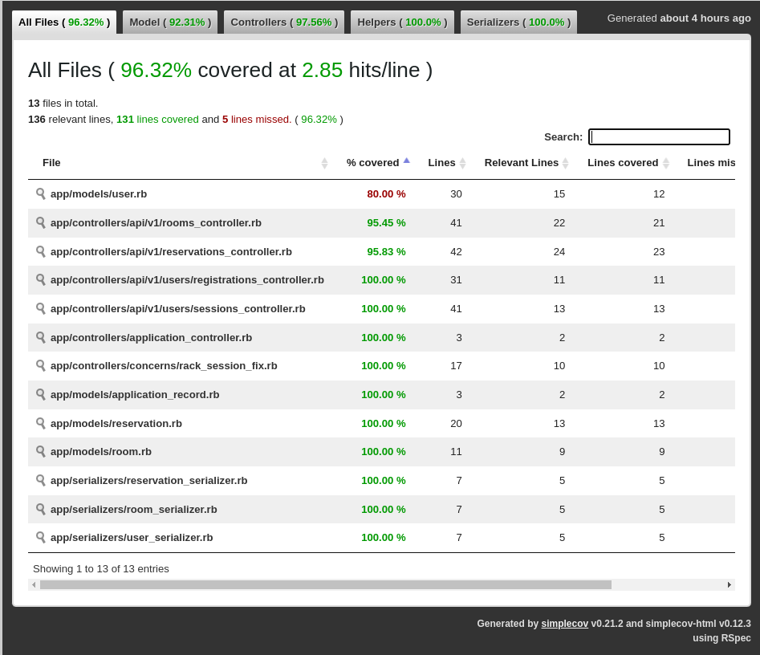
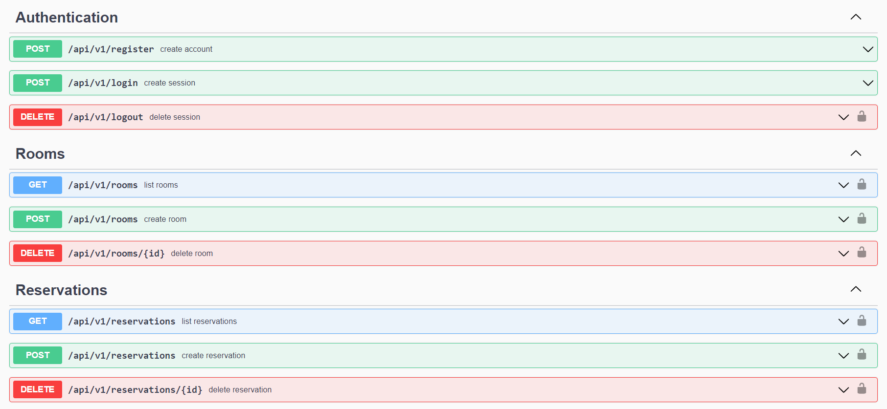

# Yellow Rooms - Back-end

>  Yellow rooms have been created to save reservations of a Hotel room. On this repository, we created the database with Postgresql following the ERD design...

<br />


<br />

> We created it following the BDD method (Behavioral Driven Development). To improve the efficiency of our test, we add to this project a coverage gem to allow us to keep a register of the test behavior.

> > The coverage gem generates an HTML inform that can be found in the path `YellowRooms-Back/coverage/index.html`

<br />


<br />

> We documented the Api's endpoints with Swagger. You can check it [here](https://yellow-rooms.herokuapp.com/api-docs).

<br />


<br />


## Built With

- Ruby on Rails
- PostgresSQL
- Rspect to tests
- Swagger to create Api documentation
- Deployed in Heroku

## Api's Endpoints

> Authentication
``````````
POST  /api/v1/register
create account

POST  /api/v1/login
create session

DELETE  /api/v1/logout
delete session
````````````

> Rooms
````````````
GET  /api/v1/rooms
list rooms

POST  /api/v1/rooms
create room

DELETE  /api/v1/rooms/{id}
delete room
`````````````
> Register
`````````````
GET  /api/v1/reservations
list reservations

POST  /api/v1/reservations
create reservation

DELETE  /api/v1/reservations/{id}
delete reservation
`````````````

## Getting Started

- [Install Ruby](https://www.ruby-lang.org/en/documentation/installation/) on your local machine
- Clone [this repository](https://github.com/marurevi/YellowRooms-Back.git)

```
git@github.com:marurevi/YellowRooms-Back.git
```
- To get started, In the root directory run:

```
gem install bundler
```

Then run:

```
bundle install
```

Open terminal and run ruby app in the command Line:

```
bin/main
```
In case you want to run test, write the following command in your terminal:
```
bin/rspec
```

## Authors

👤 Andres Agudelo

- GitHub: [@anagudelogu](https://github.com/anagudelogu)
- Twitter: [@AgudeloAndres\_\_](https://twitter.com/AgudeloAndres__)
- LinkedIn: [Andres Agudelo Guzman](https://linkedin.com/in/aagst)


👤 Mariana Revilla Lérida


- GitHub: [@marurevi](https://github.com/marurevi)
- Twitter: [@MaruRevilla](https://twitter.com/MaruRevilla)
- LinkedIn: [Mariana-Revilla-Lérida](https://linkedin.com/in/mariana-revilla-l%C3%A9rida-a12aba143)

👤 Axel Soler

- GitHub: [@AxelSoler](https://github.com/AxelSoler)
- LinkedIn: [Axel Soler](https://www.linkedin.com/in/axel-soler-685985232/)
- Twitter: [Axel Soler](https://twitter.com/AxelSoler18)


👤 **Tadesse Alemayehu**

- GitHub: [@Tadess-Alemayehu](https://github.com/Tadesse-Alemayehu)
- Twitter: [@TadesseWebDev](https://twitter.com/TadesseWebDev)
- LinkedIn: [Tadesse Alemayehu](https://www.linkedin.com/in/tadesse-alemayehu-60141a221/)

## 🤝 Contributing

Contributions, issues, and feature requests are welcome!

Feel free to check the [issues page](../../issues/).

## Show your support

Give a ⭐️ if you like this project!

## 📝 License

This project is [MIT](./MIT.md) licensed.
